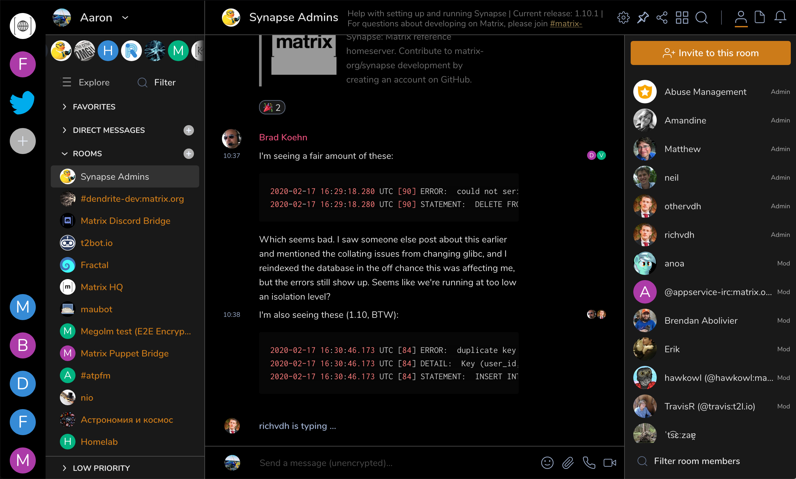
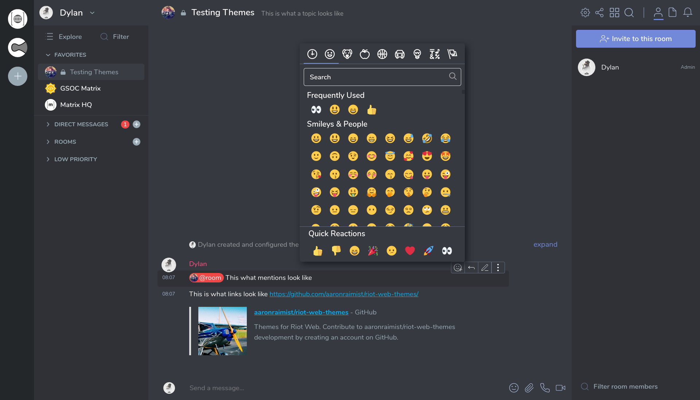

.. contents::

# riot-web-themes
A place to share themes for [Riot Web](https://github.com/vector-im/riot-web). See the [theming documentation](https://github.com/vector-im/riot-web/blob/master/docs/theming.md) for more information on how these work.

There are several different ways to use these. Unfortunately [Riot doesn't yet provide an easy one click way to install themes](https://github.com/vector-im/riot-web/issues/12517). Some options for installing themes include:

#### If you self host Riot or use Riot Desktop:
You can use these themes by editing your `config.json` file to include the theme inside of the `settingDefaults` section like this:

```json
"settingDefaults": {
    "custom_themes": [
        {
            "name": "Example theme",
            "colors": {
                "primary-color": "#9F8652"
            }
        },
        {
            "name": "Another theme",
            "colors": {
                "primary-color": "#526A9E"
            }
        }
    ]
}
```

To setup a `config.json` file with Riot Desktop, see https://github.com/vector-im/riot-web/blob/master/docs/config.md#desktop-app-configuration

#### If you use the matrix-docker-ansible-deploy project
You can enable all of these themes just by setting `matrix_riot_web_themes_enabled: true` in your `vars.yml` file. See https://github.com/spantaleev/matrix-docker-ansible-deploy/blob/master/docs/configuring-playbook-riot-web.md#themes for more details.

#### If you are a Firefox user
You can install Radical which is Riot web bundled as a Firefox add-on. You can edit the `config.json` file right in the add-on preferences. It works really well, you should check it out. https://addons.mozilla.org/en-US/firefox/addon/radical-web/

#### Use my Riot Web instance
Alternatively you can use [my Riot Web instance](https://riot.raim.ist) which has all of these themes preinstalled so there is no configuration required.

#### Discussions
Join us in [#riot-web-themes:m.dhdf.dev](https://matrix.to/#/!pjCLhvJxLkGjNQFqcB:m.dhdf.dev?via=m.dhdf.dev&via=raim.ist&via=t2bot.io)

# Themes

## [ThomCat Black](ThomCat/ThomCat-Black.json)

Made by `@me:thomcat.rocks`




## [Discord Dark Theme](Discord/Discord-Dark/Discord-Dark-Theme.json)

Made by `@dhmf:dhdf.dev`




## [Nord Dark Theme](Nord/Nord%20Dark/Nord%20Dark.json)

Made by `@dhmf:dhdf.dev`


## [Nord Light Theme](Nord/Nord%20Light/Nord%20Light.json)

Made by `@dhmf:dhdf.dev`


## [Selenized Light Theme](Selenized/Selenized%20Light/Selenized%20Light.json)

Made by `@dhmf:dhdf.dev`


## [Selenized Dark Theme](Selenized/Selenized%20Dark/Selenized%20Dark.json)

Made by `@dhmf:dhdf.dev`


## [Selenized Black Theme](Selenized/Selenized%20Black/Selenized%20Black.json)

Made by `@dhmf:dhdf.dev`


# Workarounds

Currently, custom themes might introduce some odd elements.  For example, when using ThomCat Black, the selected reaction 'pill' is outlined in green.


To fix this, we have to edit the custom theme CSS file directly, in this case `theme-dark-custom.css`.  `cssbeautify-cli` is not necessary if your `sed`-fu is better than the author's is.

```
cssbeautify-cli -f theme-dark-custom.css > /tmp/theme-dark-custom-sed.css
sed '/.mx_ReactionsRowButton.mx_ReactionsRowButton_selected/!b;n;c\ \ \ \ background-color:var(--accent-color);' /tmp/theme-dark-custom-sed.css > /tmp/theme-dark-custom.css
sudo -u <nginx/apache_user> cp /tmp/theme-dark-custom.css /<riot_directory>/bundles/<bundle_version>/
```
The results:


